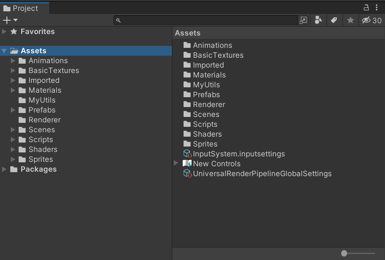

# Use-the-Force

## Description

Use the Force is a 2D platformer game where the player takes control of a “magnetically-charged character” and use the forces of surrounding magnetic fields combined with his own abilities to advance through the game’s levels. It was developed using the Unity Engine.

## Structure

The project's assets are shared among the following folders:

## Running the Game

You can build the game through the Unity Editor and then run it.

There is also a built game in the repository files. To play it, download and open the repository, then run the:

`Game/Use The Force.exe`

application.

## Mechanics

The player has basic abilities such as jump 

https://user-images.githubusercontent.com/50372934/215200761-913f4107-5010-4de6-abd9-f08c39b6b5b2.mp4

and dash:

https://user-images.githubusercontent.com/50372934/215200862-11539e4a-5b89-4481-adbe-3886809c3f53.mp4

The goal of each level is to reach the door and advance to the next one:

ADD VIDEO HERE

If the player collides with spikes or saws he dies and respawns at the currently active portal (the pink one)

https://user-images.githubusercontent.com/50372934/215200581-9a7312b0-160b-4b06-807e-be9260a45e04.mp4

The player is affected by magnetic fields based on their respective "charge" states. The player can change his own charge to reverse the direction magnetic fields push him towards.

### Magnets

https://user-images.githubusercontent.com/50372934/215209985-0251ff54-a52a-4619-9f95-f7101c5e1df4.mp4

### Forcefields

https://user-images.githubusercontent.com/50372934/215210066-86af7e40-614a-4f92-a570-d2069deed55a.mp4

There are also no-gravity fields:

ADD VIDEO HERE

Here is an example of a more complicated set of obstacles:

https://user-images.githubusercontent.com/50372934/208545806-7fa3e4cd-245f-48ab-84ff-52f6d6bfd624.mp4

## Not yet integrated mechanics

There are some fighting abilities I have not integrated to the game yet

### Blast Red

ADD VIDEO HERE

### Shoot blue

ADD VIDEO HERE

### Purple Powerup (combination of the two)

ADD VIDEO HERE
